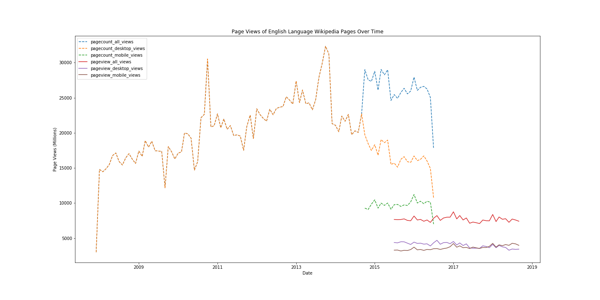

# Assignment 1: Data Curation

Part of [UW DT512](https://wiki.communitydata.cc/Human_Centered_Data_Science_(Fall_2018)/Assignments#A1:_Data_curation) class assignment.

* Goal

The notebook `hcds-a1-data-curation.ipynb` aims to construct, analyze, and publish a dataset of monthly traffic on English Wikipedia from January 1 2008 through September 30 2018.

After querying and processing the dataset, a time-series plot is obtained as below.

* License of the source data and terms of use for Wikimedia Foundation REST API can be found [here](https://www.mediawiki.org/wiki/REST_API#Terms_and_conditions)

* Several APIs used in this repo include:
  * The Legacy Pagecounts API ([documentation](https://wikitech.wikimedia.org/wiki/Analytics/AQS/Legacy_Pagecounts) and [endpoint](https://wikimedia.org/api/rest_v1/#!/Pagecounts_data_(legacy)/get_metrics_legacy_pagecounts_aggregate_project_access_site_granularity_start_end)) provides access to desktop and mobile traffic data from December 2007 through July 2016.
  * The Pageviews API ([documentation](https://wikitech.wikimedia.org/wiki/Analytics/AQS/Pageviews) and [endpoint](https://wikimedia.org/api/rest_v1/#!/Pageviews_data/get_metrics_pageviews_aggregate_project_access_agent_granularity_start_end)) provides access to desktop, mobile web, and mobile app traffic data from July 2015 through September 2018.

* The post-processed data is in the `en-wikipedia_traffic_200712-201809.csv` file with the following schema.

| Column                  | Value     | Description                                                                                                               |
|-------------------------|-----------|---------------------------------------------------------------------------------------------------------------------------|
| year                    | YYYY      | Year of access                                                                                                            |
| month                   | MM        | Month of access                                                                                                           |
| pagecount_all_views     | num_views | Aggregate of pagecount of all channels, given month-year between Jan 2008 to July 2016                                    |
| pagecount_desktop_views | num_views | Aggregate of pagecount of desktop channel, given month-year between Jan 2008 to July 2016                                 |
| pagecount_mobile_views  | num_views | Aggregate of pagecount of mobile channel, given month-year between Jan 2008 to July 2016                                  |
| pageview_all_views      | num_views | Aggregate of pageview of all channels, given month-year between July 2015 to October 2018                                 |
| pageview_desktop_views  | num_views | Aggregate of pageview of desktop channel, given month-year between July 2015 to October 2018                              |
| pageview_mobile_views   | num_views | Aggregate of pageview of mobile channels (mobile app and mobile site), given month-year between July 2015 to October 2018 |

* Known issues and special considerations include:
  * The Pageview API excludes spiders/crawlers while Legacy Pagecounts API does not.
  * The Pageview API doesn't report exact figures of pageviews per country.
  
